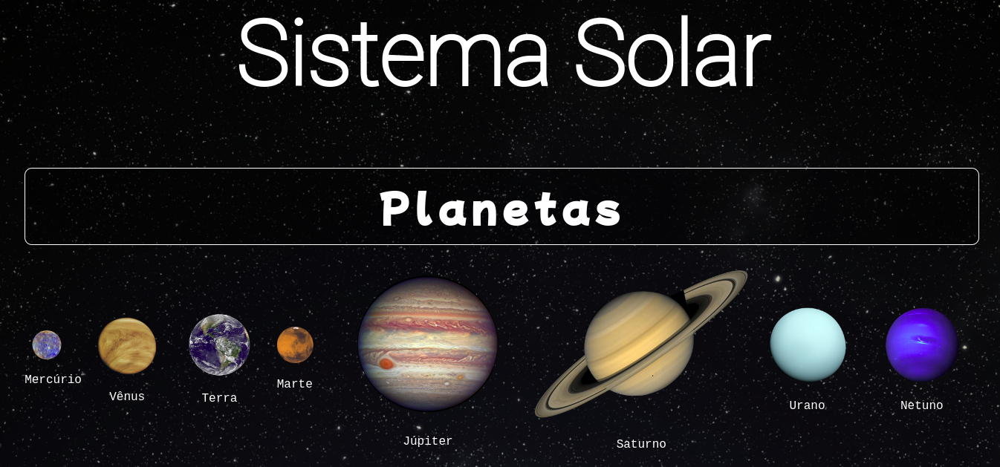

# Project Solar System

Este repositório contém o projeto Solar System desenvolvido por [Raquel G. C Würzler](https://www.linkedin.com/in/raquel-c-wurzler/) enquanto estudava na [Trybe](https://www.betrybe.com/) no módulo de FrontEnd :rocket:

_"A Trybe é uma escola do futuro para qualquer pessoa que queira melhorar de vida e construir uma carreira de sucesso em tecnologia, onde a pessoa paga quando conseguir um bom trabalho."_

#### Projeto de conclusão da seção 2, no módulo de Front-end

### Principal objetivo:
* Criar um modelo do sistema solar contendo as imagens dos Planetas e alguns cards com informações sobre missões espaciais.

### O que foi entregue:
<details>
  <summary>🤓</summary>
  

  <br />
</details>

### Detalhes desse projeto:
* Projeto feito em React;
* Todo componentizado em arquivos jsx;
* Na pasta data contém os arquivos com as informações dos planetas e das missões;


##### Arquivos disponibilizados pela Trybe:
* .env;
* .eslintignore;
* .eslintrc.json;
* .gitignore;
* .npmrc;
* .stylelintignore;
* .stylelintrc.json;
* package-lock.json;
* package.json;
* pasta public;

##### Link Deploy: https://grand-mooncake-8ca9bc.netlify.app

## Stack utilizada

**Front-end:** JavaScript, React, CSS

## Instalação e uso

```bash
# Abra um terminal e copie este repositório com o comando
git clone git@github.com:Raquel-Wurzler/project-solar-system.git

# Entre na pasta do projeto 
cd project-solar-system

# Instale as dependências
yarn install
ou 
npm install

# Rode o servidor
npm start

```
